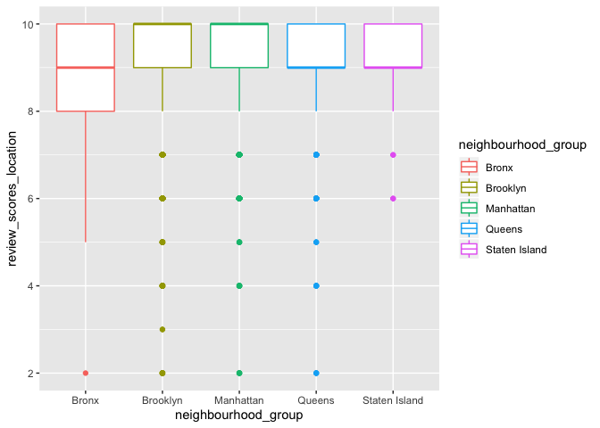

Airbnb Case
================
Alice Tivarovsky
10/8/2019

``` r
library(p8105.datasets)
data(nyc_airbnb)

nyc_airbnb
```

    ## # A tibble: 40,753 x 17
    ##        id review_scores_l… name  host_id host_name neighbourhood_g…
    ##     <dbl>            <dbl> <chr>   <dbl> <chr>     <chr>           
    ##  1 7.95e6               10 City…  1.19e5 Linda & … Bronx           
    ##  2 1.60e7               NA WATE…  9.12e6 Collins   Bronx           
    ##  3 1.89e6               NA Quai…  9.82e6 Steve     Bronx           
    ##  4 6.63e6               10 Larg…  1.39e7 Arlene    Bronx           
    ##  5 5.56e6               10 Quai…  2.88e7 Phoebe    Bronx           
    ##  6 9.15e6               10 Cozy…  4.03e5 Diane     Bronx           
    ##  7 1.17e7               10 Cozy…  5.67e7 Josue     Bronx           
    ##  8 7.15e5                9 2 Be…  3.68e6 Enrique   Bronx           
    ##  9 1.79e7               10 Spac…  1.13e7 Yahaira   Bronx           
    ## 10 1.82e5                9 PRIV…  8.73e5 Christia… Bronx           
    ## # … with 40,743 more rows, and 11 more variables: neighbourhood <chr>,
    ## #   lat <dbl>, long <dbl>, room_type <chr>, price <dbl>,
    ## #   minimum_nights <dbl>, number_of_reviews <dbl>, last_review <date>,
    ## #   reviews_per_month <dbl>, calculated_host_listings_count <dbl>,
    ## #   availability_365 <dbl>

``` r
str(nyc_airbnb)
```

    ## Classes 'spec_tbl_df', 'tbl_df', 'tbl' and 'data.frame': 40753 obs. of  17 variables:
    ##  $ id                            : num  7949480 16042478 1886820 6627449 5557381 ...
    ##  $ review_scores_location        : num  10 NA NA 10 10 10 10 9 10 9 ...
    ##  $ name                          : chr  "City Island Sanctuary relaxing BR & Bath w Parking" "WATERFRONT STUDIO APARTMENT" "Quaint City Island Community." "Large 1 BDRM in Great location" ...
    ##  $ host_id                       : num  119445 9117975 9815788 13886510 28811542 ...
    ##  $ host_name                     : chr  "Linda & Didier" "Collins" "Steve" "Arlene" ...
    ##  $ neighbourhood_group           : chr  "Bronx" "Bronx" "Bronx" "Bronx" ...
    ##  $ neighbourhood                 : chr  "City Island" "City Island" "City Island" "City Island" ...
    ##  $ lat                           : num  -73.8 -73.8 -73.8 -73.8 -73.8 ...
    ##  $ long                          : num  40.9 40.9 40.8 40.8 40.9 ...
    ##  $ room_type                     : chr  "Private room" "Private room" "Entire home/apt" "Entire home/apt" ...
    ##  $ price                         : num  99 200 300 125 69 125 85 39 95 125 ...
    ##  $ minimum_nights                : num  1 7 7 3 3 2 1 2 3 2 ...
    ##  $ number_of_reviews             : num  25 0 0 12 86 41 74 114 5 206 ...
    ##  $ last_review                   : Date, format: "2017-04-23" NA ...
    ##  $ reviews_per_month             : num  1.59 NA NA 0.54 3.63 2.48 5.43 2.06 5 2.98 ...
    ##  $ calculated_host_listings_count: num  1 1 1 1 1 1 1 4 3 4 ...
    ##  $ availability_365              : num  170 180 365 335 352 129 306 306 144 106 ...

``` r
nyc_airbnb %>%
  count(room_type)
```

    ## # A tibble: 3 x 2
    ##   room_type           n
    ##   <chr>           <int>
    ## 1 Entire home/apt 19937
    ## 2 Private room    19626
    ## 3 Shared room      1190

``` r
nyc_airbnb %>%
  count(neighbourhood_group)
```

    ## # A tibble: 5 x 2
    ##   neighbourhood_group     n
    ##   <chr>               <int>
    ## 1 Bronx                 649
    ## 2 Brooklyn            16810
    ## 3 Manhattan           19212
    ## 4 Queens               3821
    ## 5 Staten Island         261

Does rating vary by neighborhood?

``` r
nyc_airbnb %>% 
  drop_na() %>% 
  group_by(neighbourhood_group, review_scores_location) %>% 
  ggplot(aes(x = neighbourhood_group, y = review_scores_location, color = neighbourhood_group)) + geom_boxplot()
```

<!-- --> Median
price

``` r
nyc_airbnb %>% 
  group_by(neighbourhood_group, room_type) %>% 
  summarize(med_price = median(price, na_rm = TRUE)) %>% 
  pivot_wider(
    names_from = room_type,
    values_from = med_price
  )
```

    ## # A tibble: 5 x 4
    ## # Groups:   neighbourhood_group [5]
    ##   neighbourhood_group `Entire home/apt` `Private room` `Shared room`
    ##   <chr>                           <dbl>          <dbl>         <dbl>
    ## 1 Bronx                            100              55            43
    ## 2 Brooklyn                         145              65            40
    ## 3 Manhattan                        190              90            65
    ## 4 Queens                           119              60            39
    ## 5 Staten Island                    112.             55            25
